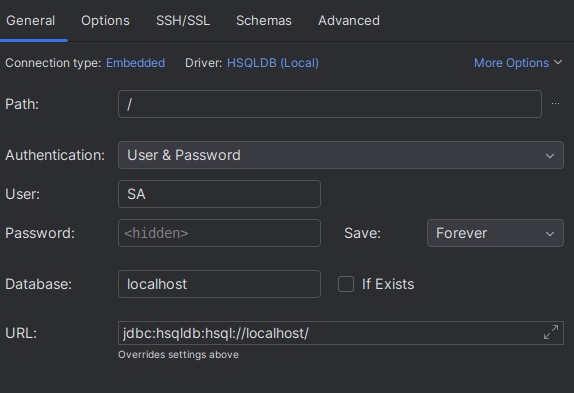
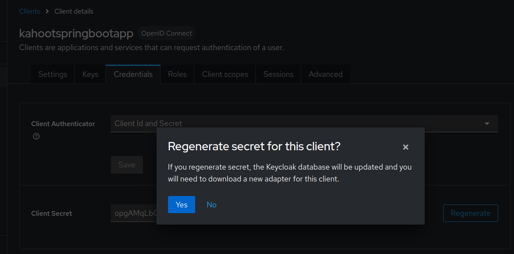
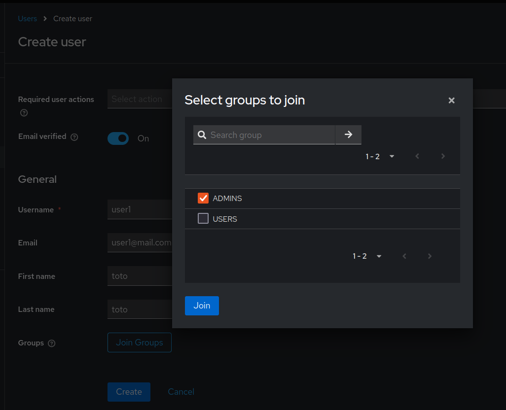
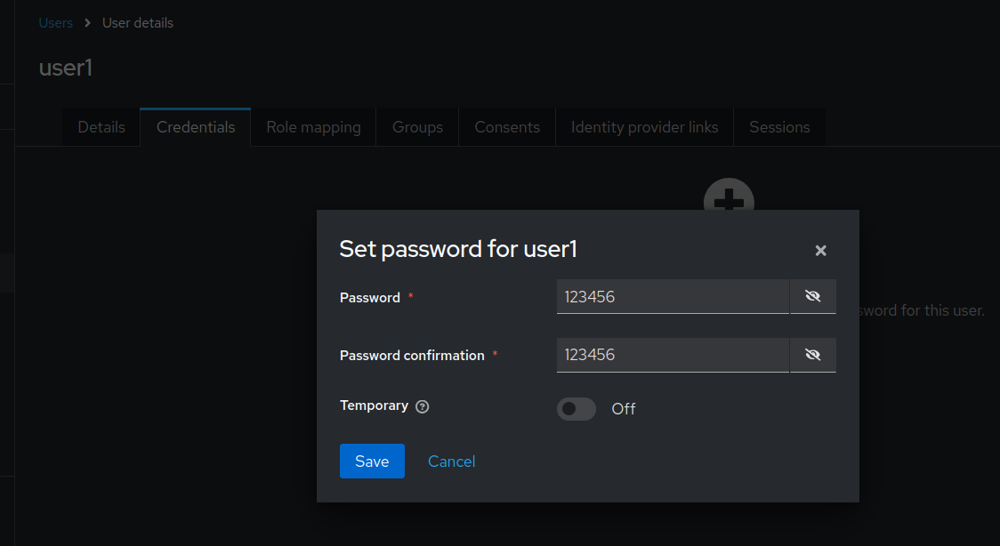
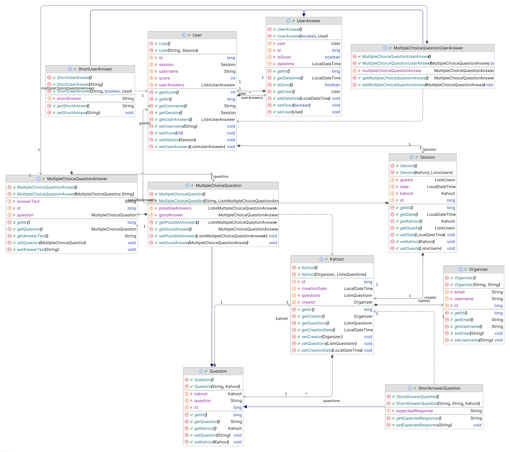

# TP : Application Spring-boot

## Description

Ce projet est une application Java utilisant JPA (Java Persistence API) pour la gestion des données et JAX-RS (Java API for RESTful Web Services) pour la création d'API REST.

### Fonctionnalités principales :
- Gestion des entités avec JPA
- Création d'API RESTful avec JAX-RS

## Prérequis

Avant de commencer, assurez-vous d'avoir installé les éléments suivants sur votre machine :

- **JDK 17** : [Installer le JDK](https://www.oracle.com/java/technologies/javase-downloads.html)
- **Maven** : [Télécharger Maven](https://maven.apache.org/download.cgi)
- **Docker** : [Documentation](https://docs.docker.com/)

### 1. Cloner le dépôt

```bash
git clone https://github.com/votre-utilisateur/votre-projet.git
cd votre-projet
```
### 2. Installation des dépendances

Utilisez Maven pour construire le projet et télécharger les dépendances.

```bash
mvn clean install
```
* Launch the application (com.KahootSpringApplication)
* Launch the Keycloack docker server :
    ```shell
    docker run -p 8080:8080 -e KEYCLOAK_ADMIN=admin -e KEYCLOAK_ADMIN_PASSWORD=admin quay.io/keycloak/keycloak:latest start-dev
    ```
* Connect to keycloack [admin console](http://localhost:8080/admin/master/console/) with credentials _admin:admin_
* Import Realm settings from this repository : [realm-export.json](keycloack/realm-export.json) into _Realms settings > Action > Partial import_


## Lancer l'application

### 1. Lancer le serveur de BDD mysql

En ligne de commande :
* Sur linux :
```bash
./run-hsqldb-server.sh
```
* Sur windows :
```bash
./run-hsqldb-server.bat
```

#### 1.1. Visualiser le contenu de la BDD
* Sur linux :
```bash
./show-hsqldb.sh
```
* Sur windows :
```bash
./show-hsqldb.bat
```
* Directement dans intellij dans l'onglet Database, nécessite de compléter les informations suivantes :



### 2. Lancer le serveur Keycloack

#### 2.1. Lancer le conteneur Docker

```bash
docker run -p 8080:8080 -e KEYCLOAK_ADMIN=admin -e KEYCLOAK_ADMIN_PASSWORD=admin quay.io/keycloak/keycloak:latest start-dev
```

#### 2.2. Importer la configuration

Une fois le serveur lancé sur le port 8080, accéder à l'[interface](localhost:8080).

* Connectez vous avec les identifiants _admin_:_admin_.
* Cliquez en haut à gauche sur le sélecteur puis _Create realm_
* Chargez le fichier : [keycloack/realm-export.json](keycloack/realm-export.json)
* Générez un nouveau secret pour le client dans _Clients > Credentials_:


#### 2.3. Créer un utilisateur
Une fois la configuration terminée, il faut créer un utilisateur. Dans l'onglet _Users_, ajoutez un nouvel utilisateur au groupe **USERS** avec les informations suivantes :


Le nouvel utilisateur doit maintenant apparaître dans l'onglet _Users_.

Il faut maintenant lui créer un mot de passe dans l'onglet _User > User details > Credentials_


#### 2.4. Générer le token d'authentification à l'API

Les requêtes API notamment sur les _questions_ [localhost:8082/questions](localhost:8082/questions) nécessitent de fournir un token JWT pour un utilisateur du groupe **USERS**. 
Pour générer un token à partir de l'utilisateur _user1_:_123456_ précédemment créé en mettant bien à jour le _client_secret_ avec celui généré:

```bash
export TOKEN=$(curl --location 'http://localhost:8080/realms/kahootrealm/protocol/openid-connect/token' --header 'Content-Type: application/x-www-form-urlencoded' --data-urlencode 'username=user1' --data-urlencode 'password=123456' --data-urlencode 'grant_type=password' --data-urlencode 'client_id=kahootspringbootapp' --data-urlencode 'client_secret=<client_secret>' --data-urlencode 'scope=openid'| jq -r '.access_token')
```

### 3. Via Maven (Ou directement via l'interface intellij)

Exécuter [com.KahootSpringApplication](src/main/java/com/KahootSpringApplication.java)

### 4. Accès à l'API

Une fois l'application démarrée, vous pouvez accéder à votre API via votre navigateur [localhost:8082](http://localhost:8082) ou un outil comme [Postman](https://www.postman.com/). Par exemple :

* [localhost:8082/sessions/](localhost:8082/sessions/) : Permet de visualiser la liste des sessions en BDD.

### 5. Accès au swagger API

Vous pouvez également accéder au swagger API (format openapi) : [localhost:8082/api/swagger](http://localhost:8082/api/swagger) ou un outil comme [Postman](https://www.postman.com/). Par exemple :

## Fonctionnalités API

### Le Swagger
[Swagger](http://localhost:8082/api/swagger), permet de visualiser le format des requêtes API.

## Structure du projet

### 1. Diagramme de classes du domaine entités


### 2. Sources
```bash
src/main/java/
└── com
    ├── aspects
    │   └── ServiceLogger.java
    ├── config
    │   └── WebSecurityConfig.java
    ├── domain
    │   ├── Kahoot.java
    │   ├── MultipleChoiceQuestionAnswer.java
    │   ├── MultipleChoiceQuestion.java
    │   ├── MultipleChoiceUserAnswer.java
    │   ├── Organizer.java
    │   ├── Question.java
    │   ├── Session.java
    │   ├── ShortAnswerQuestion.java
    │   ├── ShortUserAnswer.java
    │   ├── UserAnswer.java
    │   └── User.java
    ├── dto
    │   ├── get
    │   │   └── UserGetDTO.java
    │   ├── KahootDTO.java
    │   ├── MultipleChoiceQuestionAnswerDTO.java
    │   ├── MultipleChoiceQuestionDTO.java
    │   ├── OrganizerDTO.java
    │   ├── post
    │   │   └── UserPostDTO.java
    │   ├── QuestionDTO.java
    │   ├── QuestionType.java
    │   ├── SessionDTO.java
    │   ├── ShortAnswerQuestionDTO.java
    │   └── UserAnswerDTO.java
    ├── exceptions
    │   └── ResourceNotFoundException.java
    ├── KahootSpringApplication.java
    ├── mapper
    │   └── MapStructMapper.java
    ├── services
    │   ├── IKahootRepository.java
    │   ├── IOrganizerRepository.java
    │   ├── IQCMAnswerRepository.java
    │   ├── IQuestionRepository.java
    │   ├── ISessionRepository.java
    │   ├── IUserAnswerRepository.java
    │   └── IUserRepository.java
    └── web
        ├── KahootController.java
        ├── QuestionController.java
        ├── ResourceNotFoundAdvice.java
        ├── SessionController.java
        ├── UserController.java
        └── ViewController.java
```

## Auteur

Pierre TRETON